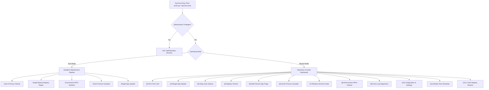

<!-- HEADER SECTION -->
<div align="center">

# SysCare

**Lightweight, portable, and zero-dependency Windows system maintenance suite with dual-mode cleanup, single-backup registry repair, multi-version app purge, and Smart Process Guardian.**

<!-- BADGES -->
[](#)
[](https://shawkath646.dev)
[](https://clouburstlab.com)
[](#-license)
[](https://python.org)
[](#-how-to-run)

</div>

---

### 📋 Project Overview

| Property | Details |
| :--- | :--- |
| **Author** | [Shawkat Hossain Maruf](https://shawkath646.dev) |
| **Platform** | Windows 10 / Windows 11 (CLI & Standalone Portable Executable) |
| **Period / Timeline** | Sep 2026 – Present |
| **Status** | Production Ready |
| **Primary Stack** | Python 3 (Standard Library), Win32 API, PyInstaller, PowerShell |

---

<!-- UI / DEMO SECTION -->
## 📱 Preview & Demo

<div align="center">

```text
========================================================================================
     ███████╗██╗   ██╗███████╗ ██████╗ █████╗ ██████╗ ███████╗
     ██╔════╝╚██╗ ██╔╝██╔════╝██╔════╝██╔══██╗██╔══██╗██╔════╝
     ███████╗ ╚████╔╝ ███████╗██║     ███████║██████╔╝█████╗  
     ╚════██║  ╚██╔╝  ╚════██║██║     ██╔══██║██╔══██╗██╔══╝  
     ███████║   ██║   ███████║╚██████╗██║  ██║██║  ██║███████╗
     ╚══════╝   ╚═╝   ╚══════╝ ╚═════╝╚═╝  ╚═╝╚═╝  ╚═╝╚══════╝
                     Personal Windows Care, Cleaner & Optimizer v1.0.0
                              [Running as Administrator]
========================================================================================
  [1] 🚀 Auto Mode   — One-Click Smart System Care
  [2] 🛠️  Manual Mode — Interactive Dashboard
  [0] ❌ Exit
========================================================================================
```

</div>

---

## 🎯 Purpose & Problem Statement

### Why It Exists
Over time, Windows machines accumulate gigabytes of disposable temp files, dead registry associations, duplicate runtime versions (such as parallel installations of Python, Java JDKs, Node.js, and CUDA toolkits), broken environment variable paths, and orphaned services left behind by uninstalled software. 

Most third-party cleaning utilities come bloated with telemetry, background background daemons, adware, or dangerous registry scrubbers that risk bricking the OS without a deterministic rollback plan. 

**SysCare** was engineered to solve this problem from first principles: an ultra-lightweight, completely portable, and 100% zero-dependency maintenance utility built purely on Python's standard library and native Windows APIs. It enforces a strict **Single-Backup Guarantee** for all registry operations, preserves all sensitive browser logins and user sessions, and offers both automated 1-click execution and fine-grained interactive control.

### What It Solves
- **Eliminating Bloatware & External Dependencies:** Requires zero `pip install` packages and runs either directly from source or as a standalone 9.1 MB `.exe` requiring no runtime setup.
- **Risk-Free Registry Repair:** Eliminates backup hoarding by automatically replacing previous backups with a single, reliable snapshot (`backups/syscare_registry_latest.reg`) that can be restored with a single click.
- **Obsolete Multi-Version Runtime Purge:** Identifies parallel co-existing versions of developer toolchains and software, identifying the latest release and cleanly pruning obsolete remnants.
- **Stealthy Rogue Process Detection:** Employs a low-overhead Win32 Kernel32 scanner to detect masquerading system binaries, executables running from `%TEMP%` or `Downloads`, and headless memory hogs (>450 MB RAM).
- **Stale Environment Variable Sanitation:** Prunes dead directory paths and duplicate segments from both User and System `PATH` variables, broadcasting changes immediately via Windows `WM_SETTINGCHANGE`.

---

## 💡 Key Insights & Architecture

- **Dual-Engine Execution Flow:**
  - **Auto Mode:** Headless, automated routine executing full system junk elimination, single-backup registry repair, PATH deduplication, Smart Process Guardian check, and Winget app updates without micro-prompts.
  - **Manual Dashboard:** 12-item interactive menu allowing granular inspection, dry-run scans, selective category toggling, and weekly task scheduling.
- **Kernel32 & Native Win32 API Integration:**
  Directly interfaces with `ctypes.windll.kernel32`, `advapi32.dll`, and `winreg` for high-throughput process querying, privilege verification, token elevation, and registry manipulation without third-party dependencies.
- **Non-Destructive Privacy & Safety Guard:**
  Cleans browser caches across Chrome, Edge, Brave, and Firefox without touching user logins, session tokens, passwords, or bookmarks. Protects pinned taskbar shortcuts (`CustomDestinations`) while removing dead JumpLists (`AutomaticDestinations`).
- **Deterministic Rollback & Backup Management:**
  Enforces atomic single-file backup storage before any registry or PATH modification. Rolling back is always instantaneous and predictable.

### System Architecture Flow



---

## 🛠️ Tech Stack & Dependencies

- **Core Language:** Python 3 (100% Standard Library — zero external package dependencies)
- **Native OS APIs:** Win32 API (`ctypes.windll`, `kernel32`, `advapi32`), `winreg` (Windows Registry API)
- **Terminal Presentation:** Native Windows Virtual Terminal Sequences (ANSI Colors & Formatted Tables)
- **System Utilities Integrated:** Windows Package Manager (`winget`), Windows Event Utility (`wevtutil`), Windows Script Host (`wscript`)
- **Compilation & Packaging:** PyInstaller (compiled into a single portable binary `SysCare.exe`, ~9.1 MB)

---

## 🚀 Getting Started

### Prerequisites
Make sure your system meets the following requirements:
- **Operating System:** Windows 10 or Windows 11 (64-bit)
- **Permissions:** Administrator access (required for system-wide temp files, registry hives, and service audits)
- **Python (Optional):** Python >= 3.10 (only needed when running from source; **not required** if using `SysCare.exe`)

---

### Installation & Quick Start

```bash
# 1. Clone the repository
git clone https://github.com/shawkath646/syscare.git
cd syscare
```

#### Option A: Run Standalone Executable (No Python Required)
You can directly run the pre-compiled portable binary:
```powershell
.\SysCare.exe
```
This is a self-contained, single-file executable that can be stored on a USB drive or run anywhere on your system.

#### Option B: Run via Batch Launcher (Auto-Elevating)
Double-click `syscare.bat` or run:
```powershell
.\syscare.bat
```
This automatically requests Administrator elevation via UAC and launches the Python engine.

#### Option C: Run via Python CLI
```powershell
# Interactive startup prompt
python main.py
```

---

### Direct CLI Commands

SysCare provides granular command-line arguments for scripts, automated CI, or direct terminal execution:

| Command | Action |
| :--- | :--- |
| `python main.py --auto` | Run the complete Auto Mode maintenance suite without manual prompts |
| `python main.py --all --scan` | Perform a comprehensive dry-run scan across junk, registry, and PATH |
| `python main.py --guardian` | Run the Smart Process Guardian to inspect running processes |
| `python main.py --multiver` | Scan for multiple co-existing versions of installed applications |
| `python main.py --services --scan`| Audit Windows services for orphaned entries missing binary files |
| `python main.py --env --scan` | Scan Environment Variable PATH for stale folders and duplicates |
| `python main.py --events` | Display recent Windows Event Log system crashes and critical errors |

---

### Compiling the Standalone Binary

To recompile `SysCare.exe` from source at any time:

```powershell
# Double-click or execute the build script
.\build_exe.bat
```

The script verifies PyInstaller, builds a clean single-file executable, and outputs `SysCare.exe` in the root folder.

---

## ⚙️ Configuration & Customization

SysCare stores user preferences in `config.json`. You can modify settings via the dashboard (`Option [10]`) or edit the file directly:

```json
{
    "clean_user_temp": true,
    "clean_system_temp": true,
    "clean_crash_dumps": true,
    "clean_recent_docs": true,
    "clean_explorer_history": true,
    "clean_browser_caches": true,
    "clean_dev_caches": true,
    "clean_app_leftovers": true,
    "clean_recycle_bin": true,
    "flush_dns": true,
    "registry_clean_uninstall_leftovers": true,
    "registry_clean_broken_startup": true,
    "registry_clean_missing_app_paths": true,
    "registry_clean_stale_openwith": true,
    "registry_clean_mui_cache": true,
    "update_apps_winget": true,
    "confirm_before_clean": true,
    "exclusions": {
        "directories": [],
        "registry_keys": []
    }
}
```

---

## 📋 Manual Mode Dashboard Overview

```text
========================================================================================
  Manual Dashboard:
  [1]  🚀 All-in-One Care          (Full scan, junk, registry, PATH clean & app updates)
  [2]  🔄 Update Apps              (Scan & upgrade software via Winget)
  [3]  🧹 Junk Cleanup             (Deep clean temp, history, caches, leftovers)
  [4]  🛡️  Registry Cleanup         (Scan broken keys, single backup & fix)
  [5]  👥 Multi-Version Apps        (Detect & remove duplicate co-existing versions)
  [6]  🤖 Smart Process Guardian    (AI-style process & resource diagnosis)
  [7]  🧹 Windows Services Audit    (Detect orphaned & uninstalled services)
  [8]  🔧 Environment PATH Cleanup  (Clean stale directories & duplicate PATHs)
  [9]  📋 Event Log Summary         (Spot recent system errors & app crashes)
  [10] ⚙️  Customization & Settings (Configure cleanup toggles & exclusions)
  [11] 📅 Weekly Scheduler         (Automate regular weekly maintenance)
  [12] ⏪ Restore Registry         (Undo latest registry cleanup)
  [0]  ⬅️  Back to Startup Mode
========================================================================================
```

---

## 🤝 Contributing & Support

Contributions, feature requests, and bug reports are welcome!
1. Fork the Project
2. Create your Feature Branch (`git checkout -b feature/AmazingFeature`)
3. Commit your Changes (`git commit -m 'Add some AmazingFeature'`)
4. Push to the Branch (`git push origin feature/AmazingFeature`)
5. Open a Pull Request

If you run into any issues, please submit a report on the [Issue Tracker](https://github.com/shawkath646/syscare/issues).

---

## 📄 License

Distributed under the [MIT License](LICENSE). See `LICENSE` for more information.

---

<!-- BRANDING FOOTER -->
<div align="center">
  <sub>Engineered by</sub><br/>
  <strong><a href="https://shawkath646.dev">Shawkat Hossain Maruf</a></strong>
  <br/><br/>
  <sub>A product of</sub><br/>
  <a href="https://clouburstlab.com" target="_blank" rel="noopener noreferrer">
    <picture>
      <source media="(prefers-color-scheme: dark)" srcset="https://assets.clouburstlab.com/branding/icon_dark.png">
      <source media="(prefers-color-scheme: light)" srcset="https://assets.clouburstlab.com/branding/icon_light.png">
      
    </picture>
  </a>
</div>
